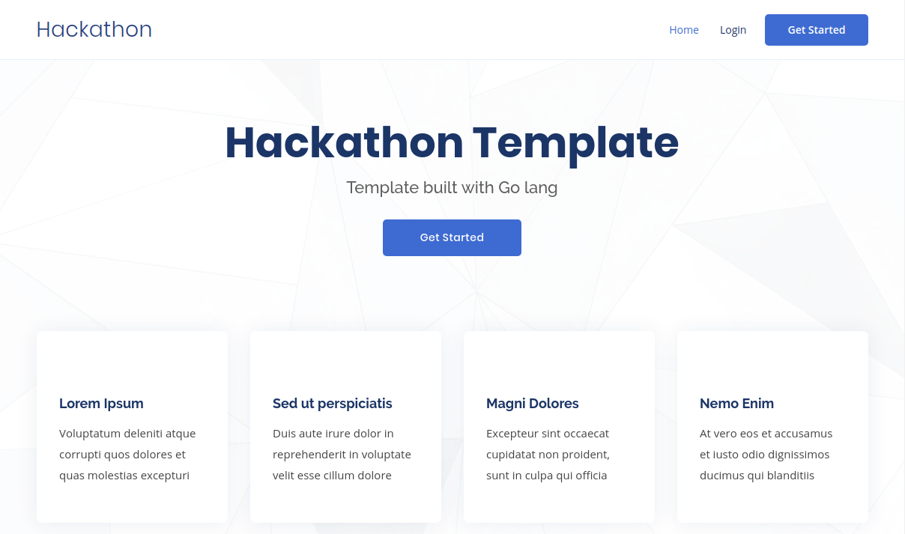

# Hackathon Starter Kit(Go lang)
###### Still under development👷....

A Golang Boilerplate with Authentication(Local, Github, Facebook, Twitter, Google, LinkedIn, Dropbox, Slack, Discord), Authorization, and CRUD functionality + PWA Support! View app here https://salty-basin-02063.herokuapp.com/

Inspired by Obinna Odirionye's Node/Typescript starter kit https://github.com/nerdeveloper/hackathon-starter-kit




##### You can view the application here
https://salty-basin-02063.herokuapp.com/

### Setting up
```bash
# Change directory to your go src folder
 cd $GOPATH/src

# Get the latest code
 git clone https://github.com/phirmware/Hackathon-starter-kit.git

# Check the files
 ls hackathon-starter-kit/

# Setup postgres database with docker
 cd hackathon-starter-kit/database

# Run the shell script
 ./setupDB.sh

# Move back to parent directory
 cd ..

# Run main.go file
go run main.go

# or run with file watcher
fresh

```